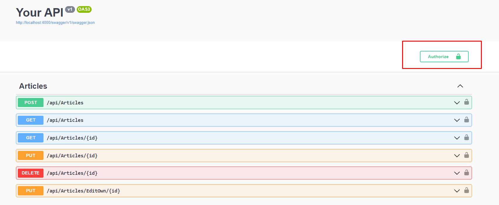
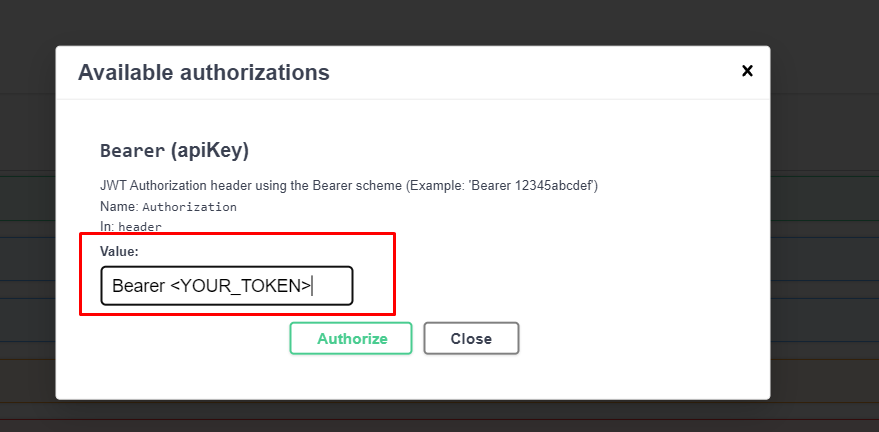

# Assignment for week 14 in SSD
This is a small API to demonstrate the principle of least privilege.

## How to Run 

**IMPORTANT** You _must_ create a `secrets.json` file for this to run. The file is ignored in git.

1. Create a `secrets.json` file at `./Week14Security/secrets.json` (the project file). The file should look like this:

```json
{
  "Jwt": {
    "Key": "YourSecretKeyForAuthenticationOfNewSite"
  }
}
```

2. `cd Week14Security`
3. `dotnet run --urls="http://localhost:4000"`
4. visit `http://localhost:4000/swagger` 

## Quick run-down

There is an endpoint for creating new users, but the database is initialized with users of each category (Editor, Jorunalist, Subscriber). They all have the password `hej`. Usernames can be found by using the `GET /api/User` endpoint.

To authenticate as either of the user, utilize the `/api/User/authenticate` endpoint. This will grant you a token. Copy the token.

In swagger there is an "Authorize button" in the top. 



Use this and type in "Bearer" followed by the token in the value field.  



If you are not using swagger, just use the "Bearer <YOUR_TOKEN>" in the header.

## Note on JWT
The JWT key is currently stored in an environment variable for development purposes. For production environments, this secret should be generated using a cryptographically secure algorithm. Furthermore, the secret would ideally be managed using a secret management service such as Azure Key Vault or AWS secret manager or something similar. I am assuming this is outside the scope of the assignment, if not, let me know